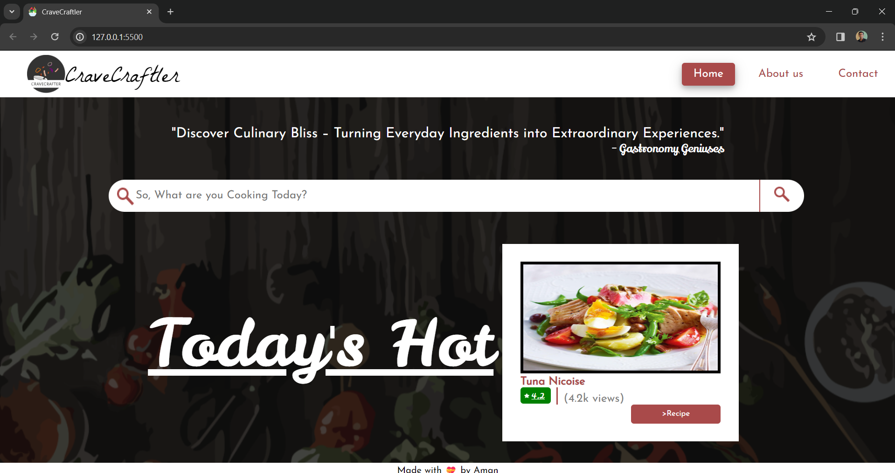
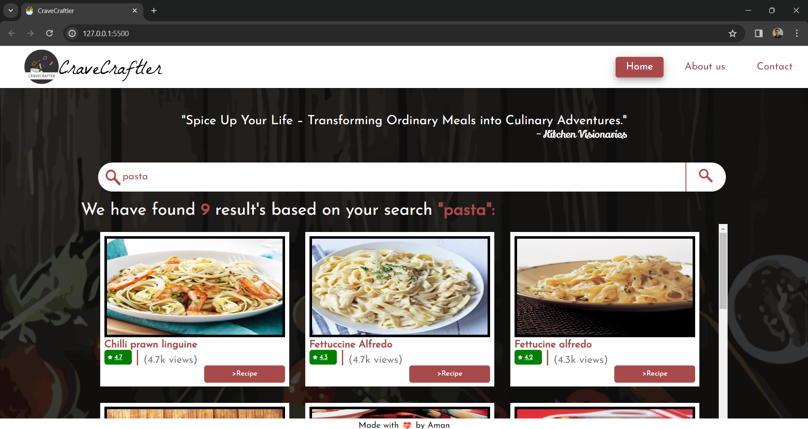
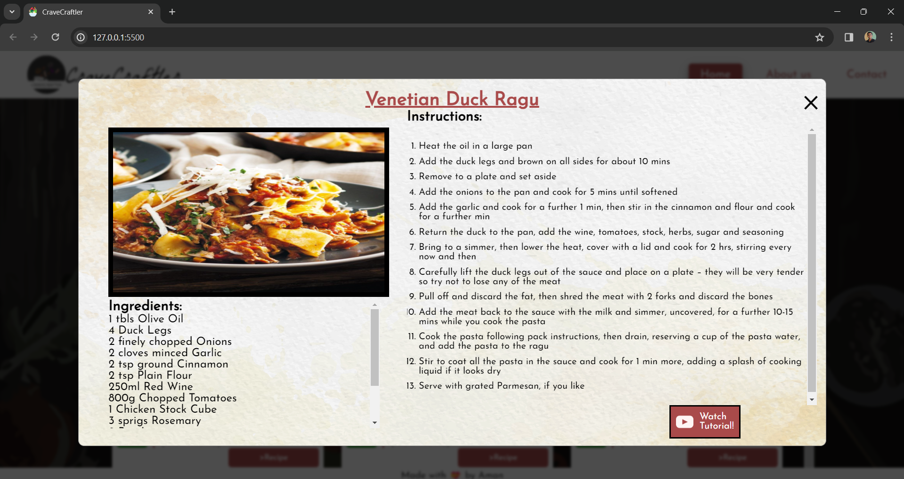
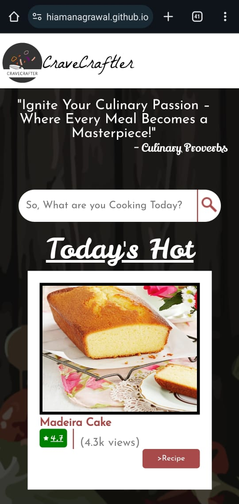
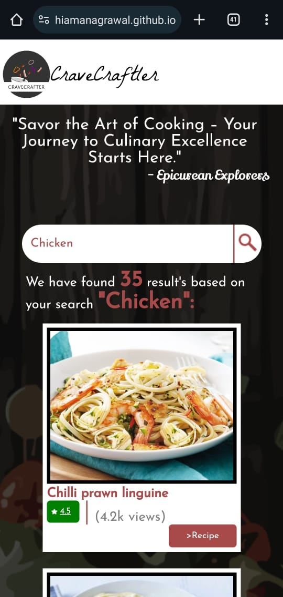
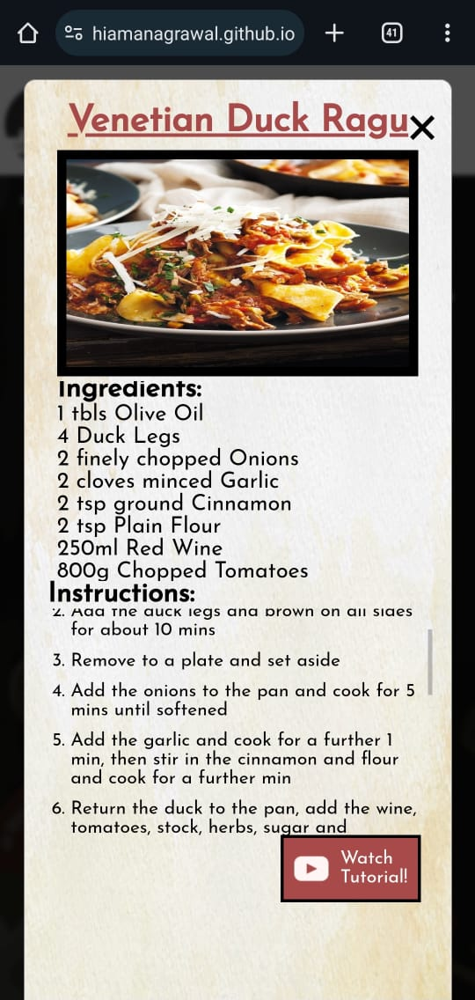

# CraveCraftler: A Recipe Finding Website.

## Project Overview

Welcome to CraveCraftler!. This fully responsive project combines design and front-end development to create a delightful food website using vanilla JS, HTML, and CSS. Users can discover random meals, explore categories, and find exciting recipes with ease.
This project falls under Kalvium's Front-end Web Development and Design For Developers | CA-3 courses. - [Aman Agrawal](https://linktr.ee/hiamanagrawal), from Squad-59 at Chitkara University, Himachal Pradesh, submitted this project.

## Functionality Highlights

- **Random Meal:** Explore a new meal on every page refresh.
- **Search Categories:** Find meals based on specific categories.
- **Modal Details:** Click on a meal to view ingredients in a modal.
- **Star Ratings:** Added functionality for star ratings.
- **Views Counter:** Implemented views functionality for each meal.
- **Instructions List:** Converted paragraph instructions into a formatted list.
- **Random Quote:** Discover daily inspiration with a randomly generated quote.
  - The website fetches quotes from an external API, offering a touch of wisdom or motivation on each visit.

## Screenshots

### Mobile View

## Milestones

1. **Design Finalization and Low-fidelity Prototype:** Completed the design for both desktop and mobile views.Also,Shared Figma links and walkthrough videos for design evaluation.
2. **Data Fetching:** Successfully fetched and displayed data from the provided APIs.
3. **CSS Implementation:** Added CSS to enhance website aesthetics.
4. **Functionality Additions:** Introduced star ratings, views counter, and instructions list.
5. **Testing and Bug Fixing:** Ensured a smooth user experience, no console warnings or errors.

## Deliverables

### Design for Developers

- **Figma Links:**
  - [Desktop View](https://www.figma.com/file/85sg1QS46RsZ8dS65vQf07/Untitled?type=design&node-id=0%3A1&mode=design&t=bdXhCoqFwQdZ4XLG-1)
  - [Mobile View](https://www.figma.com/file/vZBva1vuXF7WRdj4Jch6Fz/CraveCraftler-mobile?type=design&mode=design&t=bdXhCoqFwQdZ4XLG-1)
- **Walkthrough Video:** [Watch Here](https://drive.google.com/drive/folders/1RvbjZtiVQar15LqttWUgs3ocjFFsEgk3?usp=sharing)

### Front-end Web Development

- **Code Repository:** [GitHub Link](https://github.com/HiAmanAgrawal/CraveCraftler)
- **Project Output:** [Deployed Link](https://hiamanagrawal.github.io/CraveCraftler/)

## Fully Responsive Experience

This website provides a seamless experience across various devices – from desktops to mobiles. Enjoy culinary exploration anytime, anywhere!

## Credits

- **APIs:**
  - [Random Meal API](https://www.themealdb.com/api/json/v1/1/random.php)
  - [Meal by Category API](https://www.themealdb.com/api/json/v1/1/filter.php?c={category})

## Happy cooking!

